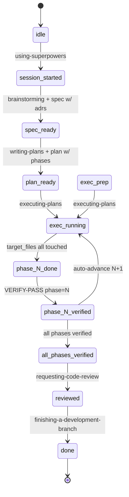
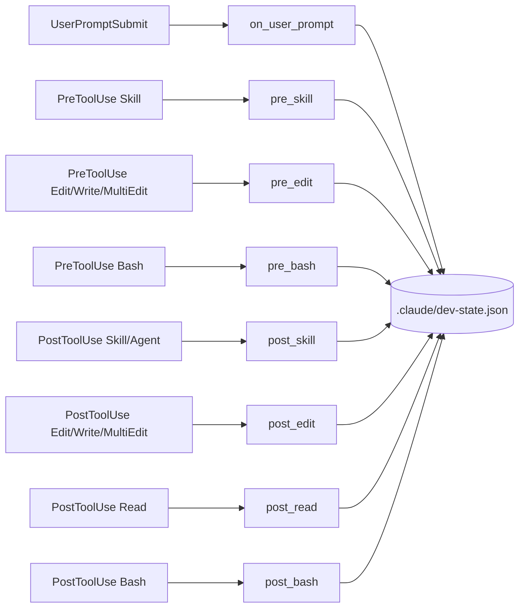

# claude-workflow

[](https://github.com/tickhuat/claude-workflow/actions/workflows/test.yml)

A hook + state-machine system that enforces a structured dev workflow on Claude Code: spec → plan → execute → verify → review → done. Stop relying on Claude's self-discipline; let the harness block deviations.

## What is this?

When Claude Code edits your codebase, this system blocks edits that skip the structured workflow. Five rules are hard-enforced via Claude Code hooks:

1. Use the right [superpowers](https://github.com/anthropics/claude-code) skill for each step (brainstorming, writing-plans, executing-plans, etc.)
2. Every architectural decision needs an ADR (Architecture Decision Record)
3. Read related ADRs before brainstorming/planning
4. Each plan phase must be verified by a fresh subagent before moving on
5. Specs/plans/ADRs live in conventional paths (`docs/superpowers/specs/`, `docs/superpowers/plans/`, `ADR/`)

## Quick start

### Use as template (recommended)

```bash
gh repo create my-project --template tickhuat/claude-workflow
cd my-project
bash scripts/init-fresh.sh   # cleans dogfood examples
```

> **Note:** `init-fresh.sh` is destructive and intended for one-time use immediately after cloning. It removes any `2026-04-*.md` files under `docs/superpowers/` — do not run it after starting your own work.

Or via GitHub UI: click "Use this template" on the repo page.

### Fork and customize

```bash
git clone tickhuat/claude-workflow my-project
cd my-project
bash scripts/init-fresh.sh
```

Optionally edit `.claude/dev-rules.config.yaml` for your project's conventions.

### Install dependencies

```bash
python3 -m pip install -e ".[dev]"
python3 -m pytest tests/ -q
```

The test suite covers the hook system, state machine, glob matching, ADR indexing, and concurrent migration — ~245 tests on a fresh checkout.

## Architecture

### State machine



Stage names use hyphens (e.g. `session-started`); the diagram uses underscores because Mermaid identifiers can't contain hyphens.

**Tool-style skills**: `using-git-worktrees` is a tool, not a state transition. It can be invoked at any stage (idle, plan-ready, exec-running, done, etc.) without advancing the dev-rules state machine. Use it whenever you need an isolated workspace. (See ADR 0020.)

### Hooks



All hook scripts are Python 3 stdlib + PyYAML + pathspec, sourced from `.claude/scripts/`. `dev-state.json` reads/writes are guarded by `fcntl.flock` so concurrent hooks don't corrupt state ([ADR 0019](ADR/0019-state-file-flock.md)).

## The 5 dev rules being enforced

1. **Sequential skill usage** — `pre_skill` blocks `brainstorming`/`writing-plans` until you've Read all referenced ADRs. The state machine blocks Edits that skip stages (e.g. editing src before brainstorming has produced a spec).
2. **ADR coverage** — Every spec/plan must declare `adrs:` in frontmatter pointing at existing ADR slugs. State transitions check this. `ADR/_index.json` is auto-rebuilt on Write to `ADR/`.
3. **Read ADRs first** — `pre_skill` checks `state.adrs_read` against required ADRs. `post_read` auto-records ADR slugs when the Read tool is used on `ADR/<slug>.md`.
4. **Phase verification** — Each plan phase declares `target_files` (globs) and `verify_command`. `post_edit` tracks target file coverage; once all target globs are touched, stage moves to `phase-N-done`. The next Edit is blocked until a fresh Agent subagent returns `VERIFY-PASS phase=N`.
5. **Conventional paths** — Specs in `docs/superpowers/specs/`, plans in `docs/superpowers/plans/`, ADRs in `ADR/`. Sensitive globs (`**/auth*`, `**/migrations/**`, etc.) always require a new ADR.

**Event flags** (`debug_required`, `parallel_required`, `review_required`) are detected from prompt keywords by `on_user_prompt`. They emit a one-time WARN to stderr on the next `Edit` and clear themselves; they do **not** block edits (per [ADR 0017](ADR/0017-event-flag-prompt-scope.md), reverted from the original "persistent BLOCK until skill invoked" design after that proved over-aggressive in practice).

## File structure

```text
.
├── .claude/
│   ├── scripts/                      # hooks (Python)
│   │   ├── lib/                      # state, frontmatter, config, adr, git_utils
│   │   ├── on_user_prompt.py
│   │   ├── pre_skill.py | pre_edit.py | pre_bash.py
│   │   └── post_skill.py | post_edit.py | post_read.py | post_bash.py
│   ├── settings.json                 # hook registration
│   ├── dev-rules.config.yaml         # project-shared overrides
│   └── dev-rules.config.local.yaml   # personal overrides (gitignored)
├── ADR/                              # architecture decision records
│   ├── 0000-template.md
│   └── _index.json                   # auto-rebuilt
├── docs/superpowers/
│   ├── specs/                        # brainstorming output
│   └── plans/                        # writing-plans output
├── tests/                            # pytest tests for hooks
├── scripts/init-fresh.sh             # strip dogfood examples
├── .gitignore                        # ignores .claude/dev-state.json + config.local.yaml
├── pyproject.toml
├── LICENSE
├── CLAUDE.md                         # project conventions seen by Claude
└── README.md
```

## Customization

`.claude/dev-rules.config.yaml` lets you override:

- `sensitive_globs`: paths that always require a new ADR (default: `**/auth*`, `**/migrations/**`, `**/*.config.*`, etc.)
- `event_keywords`: words in user prompts that trigger event flags (debug/parallel/review)
- `global_whitelist`: paths allowed at any stage (default: `*.md`, `docs/**`, etc.)
- `auto_advance_phase`: auto-bump current_phase after VERIFY-PASS (default: `true`)
- `commit_deviation_keyword`: marker required in commit message when deviating (default: `Deviation:`)

Copy any field to `.claude/dev-rules.config.local.yaml` for personal overrides (gitignored).

## Examples (dogfood)

This repo dogfoods its own dev-rules. Browse:

- [docs/superpowers/specs/2026-04-29-dev-rules-enforcement-design.md](docs/superpowers/specs/2026-04-29-dev-rules-enforcement-design.md) — the original spec for this enforcement system
- [docs/superpowers/plans/2026-04-29-dev-rules-enforcement.md](docs/superpowers/plans/2026-04-29-dev-rules-enforcement.md) — the implementation plan that delivered it
- [ADR/0001-adopt-hook-state-machine-enforcement.md](ADR/0001-adopt-hook-state-machine-enforcement.md) — the founding architectural decision

These (and other dogfood files in `docs/superpowers/` and `ADR/`) are removed by `scripts/init-fresh.sh` when you start your own project.

## Desktop Notifications (macOS / Linux)

Optional desktop notifications fire when:

- A Claude turn finishes (`stop` event)
- Claude is waiting for your input or permission (`input` event)
- A subagent task completes (`subagent_stop` event — useful when running
  many Agent tool calls back-to-back, since `stop` only fires once at the
  end of the whole turn, not per subagent)

**Platform support** (per [ADR 0022](ADR/0022-notify-sh-cross-platform.md)):

- macOS: uses built-in `osascript` (no install needed)
- Linux / WSL: uses `notify-send` (install via `apt install libnotify-bin` on Debian/Ubuntu, `pacman -S libnotify` on Arch)
- Other platforms: silently no-op; debug log records `platform=other`

All default to **OFF**. Toggle by creating / removing flag files in `~/.claude/`:

```bash
# Enable all three
touch ~/.claude/.notify-stop ~/.claude/.notify-input ~/.claude/.notify-subagent-stop

# Enable only "needs input" (recommended — `stop` fires every turn, can be noisy)
touch ~/.claude/.notify-input

# Enable input + per-subagent ding (good for long subagent-driven plan executions)
touch ~/.claude/.notify-input ~/.claude/.notify-subagent-stop

# Disable everything
rm -f ~/.claude/.notify-stop ~/.claude/.notify-input ~/.claude/.notify-subagent-stop
```

`notify.sh` writes a per-invocation debug record to
`~/.claude/.notify-debug.log` (timestamp, event, platform, flag presence,
tool used, exit code, stderr). Use it to diagnose "sometimes rings,
sometimes doesn't" — missing log line means the hook didn't fire (Claude
Code event issue); present line with non-zero `rc` means the notifier
itself failed (most commonly a notification permission issue under System
Settings on macOS, or `notify-send` not installed on Linux).

The first notification triggers a macOS permission prompt — allow it under
**System Settings → Notifications**. After that, changes take effect on the
next Claude session restart (hooks are registered at session start).

### Troubleshooting

If notifications don't fire:

1. Check `~/.claude/.notify-debug.log` — each invocation writes one line
2. `flag=no` → flag file missing (touch the right `~/.claude/.notify-*` file)
3. `rc=127` + `tool=osascript` → osascript missing (shouldn't happen on macOS)
4. `rc=127` + `tool=notify-send` → install libnotify (`apt install libnotify-bin`)
5. `rc=1` + `tool=osascript` → osascript permission denied; allow under **System Settings → Notifications**
6. `platform=other` → unsupported platform (BSD, Windows, etc.) — no-op by design
7. No log line at all → hook didn't fire (Claude Code event matcher issue)

### Customizing message and sound

Edit [.claude/scripts/notify.sh](.claude/scripts/notify.sh) to change the
title, message, or sound per event. Built-in macOS sound names: `Glass`,
`Tink`, `Pop`, `Hero`, `Ping`, `Funk`, `Sosumi`, `Submarine`, `Frog`, `Blow`,
`Bottle`, `Morse`, `Purr`.

### Use globally (all projects, not just this repo)

The hooks above only fire when Claude Code's cwd is in this repo. To get
notifications in every project:

1. Copy the script: `cp .claude/scripts/notify.sh ~/.claude/scripts/notify.sh`
2. Add equivalent `Stop` / `Notification` hooks to `~/.claude/settings.json`,
   replacing `bash .claude/scripts/notify.sh` with
   `bash ~/.claude/scripts/notify.sh`.

## Emergency bypass

Set `DEV_RULES_BYPASS=1` to skip all hook enforcement for a single command. Each bypass is logged to `.claude/bypass.log` (auto-rotates to `bypass.log.old` at 1 MiB; one backup kept).

## License

[MIT](LICENSE).
