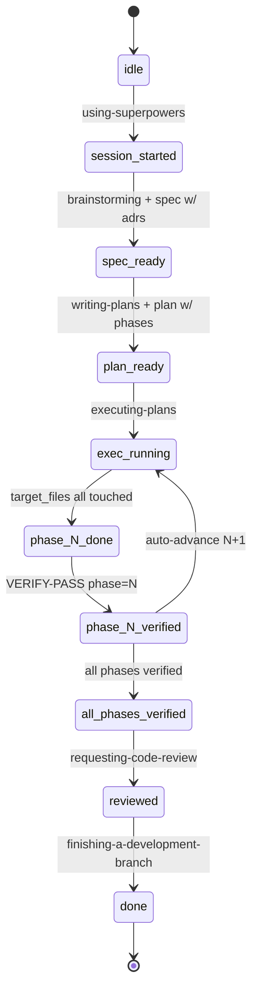
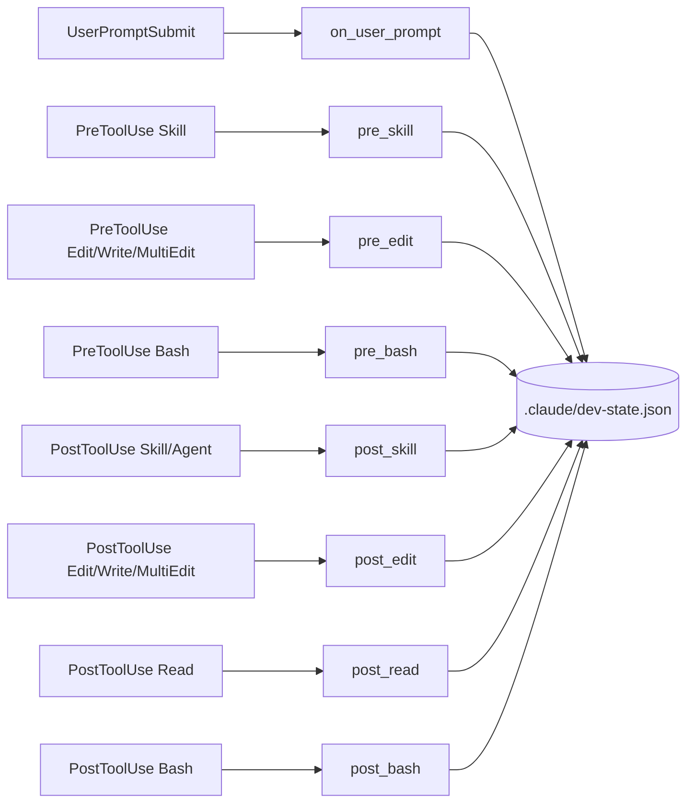

# claude-workflow

[](https://github.com/tickhuat/claude-workflow/actions/workflows/test.yml)

A hook + state-machine system that enforces a structured dev workflow on Claude Code: spec → plan → execute → verify → review → done. Stop relying on Claude's self-discipline; let the harness block deviations.

## What is this?

When Claude Code edits your codebase, this system blocks edits that skip the structured workflow. Five rules are hard-enforced via Claude Code hooks:

1. Use the right [superpowers](https://github.com/anthropics/claude-code) skill for each step (brainstorming, writing-plans, executing-plans, etc.)
2. Every architectural decision needs an ADR (Architecture Decision Record)
3. Read related ADRs before brainstorming/planning
4. Each plan phase must be verified by a fresh subagent before moving on
5. Specs/plans/ADRs live in conventional paths (`docs/superpowers/specs/`, `docs/superpowers/plans/`, `ADR/`)

## Quick start

### Use as template (recommended)

```bash
gh repo create my-project --template tickhuat/claude-workflow
cd my-project
bash scripts/init-fresh.sh   # cleans dogfood examples
```

Or via GitHub UI: click "Use this template" on the repo page.

### Fork and customize

```bash
git clone tickhuat/claude-workflow my-project
cd my-project
bash scripts/init-fresh.sh
```

Optionally edit `.claude/dev-rules.config.yaml` for your project's conventions.

### Install dependencies

```bash
python3 -m pip install --user "PyYAML>=6.0" pytest
python3 -m pytest tests/ -q
```

## Architecture

### State machine



Stage names use hyphens (e.g. `session-started`); the diagram uses underscores because Mermaid identifiers can't contain hyphens.

### Hooks



All hook scripts are Python 3 stdlib + PyYAML, sourced from `.claude/scripts/`.

## The 5 dev rules being enforced

1. **Sequential skill usage** — `pre_skill` blocks `brainstorming`/`writing-plans` until you've Read all referenced ADRs. The state machine blocks Edits that skip stages (e.g. editing src before brainstorming has produced a spec).
2. **ADR coverage** — Every spec/plan must declare `adrs:` in frontmatter pointing at existing ADR slugs. State transitions check this. `ADR/_index.json` is auto-rebuilt on Write to `ADR/`.
3. **Read ADRs first** — `pre_skill` checks `state.adrs_read` against required ADRs. `post_read` auto-records ADR slugs when the Read tool is used on `ADR/<slug>.md`.
4. **Phase verification** — Each plan phase declares `target_files` (globs) and `verify_command`. `post_edit` tracks target file coverage; once all target globs are touched, stage moves to `phase-N-done`. The next Edit is blocked until a fresh Agent subagent returns `VERIFY-PASS phase=N`.
5. **Conventional paths** — Specs in `docs/superpowers/specs/`, plans in `docs/superpowers/plans/`, ADRs in `ADR/`. Sensitive globs (`**/auth*`, `**/migrations/**`, etc.) always require a new ADR.

## File structure

```text
.
├── .claude/
│   ├── scripts/                      # hooks (Python)
│   │   ├── lib/                      # state, frontmatter, config, adr, git_utils
│   │   ├── on_user_prompt.py
│   │   ├── pre_skill.py | pre_edit.py | pre_bash.py
│   │   └── post_skill.py | post_edit.py | post_read.py | post_bash.py
│   ├── settings.json                 # hook registration
│   ├── dev-rules.config.yaml         # project-shared overrides
│   └── dev-rules.config.local.yaml   # personal overrides (gitignored)
├── ADR/                              # architecture decision records
│   ├── 0000-template.md
│   └── _index.json                   # auto-rebuilt
├── docs/superpowers/
│   ├── specs/                        # brainstorming output
│   └── plans/                        # writing-plans output
├── tests/                            # pytest tests for hooks
├── scripts/init-fresh.sh             # strip dogfood examples
├── pyproject.toml
├── LICENSE
├── CLAUDE.md                         # project conventions seen by Claude
└── README.md
```

## Customization

`.claude/dev-rules.config.yaml` lets you override:

- `sensitive_globs`: paths that always require a new ADR (default: `**/auth*`, `**/migrations/**`, `**/*.config.*`, etc.)
- `event_keywords`: words in user prompts that trigger event flags (debug/parallel/review)
- `global_whitelist`: paths allowed at any stage (default: `*.md`, `docs/**`, etc.)
- `auto_advance_phase`: auto-bump current_phase after VERIFY-PASS (default: `true`)
- `commit_deviation_keyword`: marker required in commit message when deviating (default: `Deviation:`)

Copy any field to `.claude/dev-rules.config.local.yaml` for personal overrides (gitignored).

## Examples (dogfood)

This repo dogfoods its own dev-rules. Browse:

- [docs/superpowers/specs/2026-04-29-dev-rules-enforcement-design.md](docs/superpowers/specs/2026-04-29-dev-rules-enforcement-design.md) — the original spec for this enforcement system
- [docs/superpowers/plans/2026-04-29-dev-rules-enforcement.md](docs/superpowers/plans/2026-04-29-dev-rules-enforcement.md) — the implementation plan that delivered it
- [ADR/0001-adopt-hook-state-machine-enforcement.md](ADR/0001-adopt-hook-state-machine-enforcement.md) — the founding architectural decision

These (and other dogfood files in `docs/superpowers/` and `ADR/`) are removed by `scripts/init-fresh.sh` when you start your own project.

## Emergency bypass

Set `DEV_RULES_BYPASS=1` to skip all hook enforcement for a single command. Each bypass is logged to `.claude/bypass.log`.

## License

[MIT](LICENSE).
